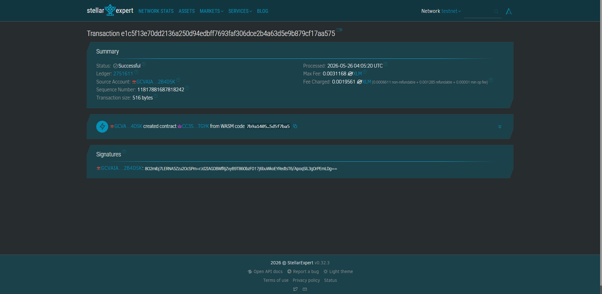

# PalayPay Escrow

PalayPay is an on-chain escrow protocol securing agricultural supply chains.

## Problem and Solution
Rice farmers wait up to 30 days for payment after delivering their harvest, leading to predatory debt cycles. PalayPay uses Soroban smart contracts to lock USDC from mills into escrow upon delivery agreement, automatically releasing funds to the farmer's mobile wallet the moment a trusted local inspector validates the yield.

## Timeline
Bootcamp / Hackathon MVP Scope (Complete end-to-end flow in < 48 hours).

## Contract ID:
CC35KEOZNR7WXOIXDOCZXYTBO3UE7UXQHAVXM73NL7M5IA6TAXC2TGYK

## Stellar Features Used
- Soroban Smart Contracts
- USDC Asset Transfers

## Vision and Purpose
To eliminate localized cash flow bottlenecks for independent farmers and automate accounts payable for local SME mills, proving that blockchain can solve real-world, non-speculative coordination problems.

## Prerequisites
- Rust (latest stable)
- `soroban-cli` (v20.0.0 or compatible)
- Stellar Testnet funded accounts

## How to Build
```bash
soroban contract build
